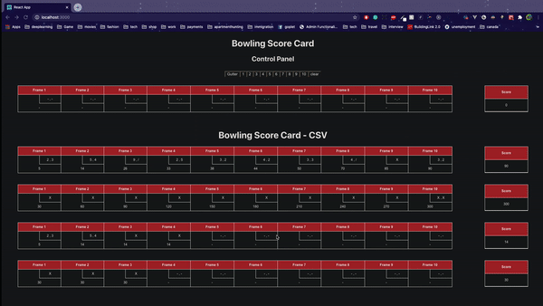

Bowling
======================================

                             ! ! ! !
                          ." ! ! !  /
                        ."   ! !   /
                      ."     !    /
                    ."           /
                  ."     o      /
                ."             /
              ."              /
            ."               /
          ."      . '.      /
        ."      '     '    /
      ."                  /
    ."     0 |           /
           |/
          /|
          / |

### Instructions to run the all

#### Client - @access [http://localhost:3000/]

##### Run
- run `cd app/client`
- run `npm run`

#### Server - @access [http://localhost:8000/]

##### Admin - @access [http://localhost:8000/admin/]
- @email: `admin@admin.com`
- @username: `admin`
- @password: `adminpassword`
##### Run
- run `cd app/server`
- run `source env/bin/activate`
- run `python manage.py migrate`
- run `pip install -r requirements.txt`
- run `python manage.py runserver`

### Access App : `http://localhost:3000/`

### Preview
